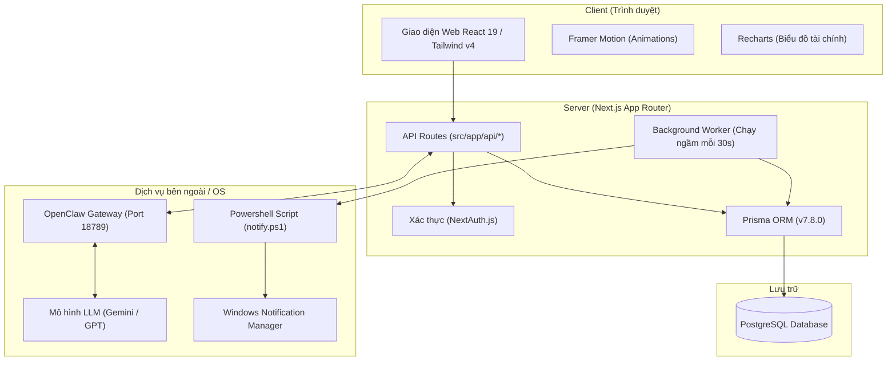

# BÁO CÁO ĐỒ ÁN MÔN HỌC
## ĐỀ TÀI: TRỢ LÝ CÁ NHÂN ĐA NĂNG TÍCH HỢP AI – STAR AI (BÉ SAO)

---

## 1. Mục Tiêu Đồ Án

### 1.1. Mục tiêu chính
Xây dựng một nền tảng trợ lý cá nhân đa năng, lấy **Trí tuệ nhân tạo (Generative AI)** làm hạt nhân để kết nối và quản lý hai trụ cột quan trọng nhất của cuộc sống hàng ngày: **Sức khỏe cá nhân** (dinh dưỡng, calo, nước uống) và **Tài chính cá nhân** (thu chi, ví tiền, ngân sách), kết hợp cùng công cụ **Lập kế hoạch công việc và lịch trình**.

### 1.2. Mục tiêu cụ thể
*   **Giao diện người dùng (UI/UX) hiện đại:** Thiết kế giao diện web hiện đại, trực quan, hỗ trợ responsive hoàn toàn trên di động. Tập trung vào trải nghiệm mượt mà, sử dụng các hiệu ứng chuyển động vi mô (micro-animations) để tăng tính tương tác.
*   **Trợ lý ảo thông minh (Star AI - Bé Sao):** Phát triển chatbot AI có tính cách rõ ràng (ngọt ngào, đáng yêu, thân thiện), xưng hô gần gũi ("Bé Sao" - "Cậu/Bạn iu"), giúp giảm bớt cảm giác khô khan khi quản lý tài chính hay theo dõi sức khỏe.
*   **Xử lý ngôn ngữ tự nhiên thành hành động (Function Calling):** Tích hợp khả năng gọi công cụ (Tool Use). Star AI có thể tự động hiểu câu lệnh không cấu trúc của người dùng (ví dụ: *"Tớ vừa ăn 1 bát phở bò"*, *"Chi 50k gửi xe bằng Techcombank"*) để tự động thêm dữ liệu vào cơ sở dữ liệu mà người dùng không cần bấm nút thủ công.
*   **Tự động hóa tính toán khoa học:** Tính toán chỉ số calo mục tiêu (BMR/TDEE) theo công thức Mifflin-St Jeor và tự động gợi ý lượng nước uống hằng ngày dựa trên các chỉ số sinh học của cơ thể.
*   **Hệ thống thông báo đẩy thời gian thực (Native Notifications):** Thiết lập daemon ngầm giúp nhắc nhở uống nước đúng giờ, báo cáo công việc đến hạn và sự kiện sắp diễn ra thông qua thông báo hệ thống Windows (Windows Toast Notifications).

---

## 2. Kiến Trúc Hệ Thống

### 2.1. Sơ đồ kiến trúc tổng quát
Hệ thống được thiết kế theo mô hình client-server hiện đại, tận dụng sức mạnh của Next.js cho cả Frontend và API Backend (Fullstack Framework).



### 2.2. Công nghệ sử dụng
*   **Frontend:**
    *   **React 19 & TypeScript:** Đảm bảo mã nguồn rõ ràng, an toàn về kiểu dữ liệu và tối ưu hóa hiệu năng render.
    *   **Tailwind CSS v4:** Công nghệ styling mới nhất giúp xây dựng giao diện nhanh chóng, nhất quán.
    *   **Framer Motion:** Thực hiện các chuyển động mượt mà cho các popup, modal, và đặc biệt là linh vật Star di động (Draggable Star).
    *   **Recharts:** Vẽ biểu đồ trực quan hóa dữ liệu biến động thu chi và cơ cấu danh mục tài chính.
*   **Backend:**
    *   **Next.js (App Router):** Hỗ trợ tối ưu hóa SEO, phân chia route rõ ràng và xây dựng serverless API gọn nhẹ.
    *   **Prisma ORM & PostgreSQL:** Công cụ truy vấn cơ sở dữ liệu mạnh mẽ, quản lý migrate và duy trì ràng buộc dữ liệu chặt chẽ.
    *   **NextAuth.js:** Quản lý đăng nhập, bảo mật thông tin và session người dùng.
*   **AI Engine:**
    *   **OpenClaw Gateway:** Proxy cổng kết nối trung gian giúp điều phối các cuộc gọi LLM và hỗ trợ cơ chế vòng lặp gọi công cụ (Function Calling loop) với số lần lặp tối đa là 4 nhằm xử lý nhiều công cụ cùng lúc.
*   **Hệ thống chạy ngầm:**
    *   **Node.js setInterval Worker:** Chạy nền độc lập trên máy chủ để quét lịch trình.
    *   **PowerShell (WinRT API):** Gọi thư viện gốc của Windows để hiển thị hộp thoại thông báo toast native đẹp mắt.

---

## 3. Chức Năng Chi Tiết

### 3.1. Phân hệ Frontend (FE)
*   **Trang chủ (Dashboard):** 
    *   Hiển thị widget tổng hợp: số nước đã uống, calo còn lại được nạp, số nhiệm vụ chưa hoàn thành.
    *   Nút ghi nhận nhanh (Quick logs) nước uống theo các mốc 200ml, 300ml, 500ml.
*   **Trình quản lý tài chính (Budget):**
    *   Bảng quản lý tài khoản nguồn tiền (ví, ngân hàng) kèm theo số dư, màu sắc nhận diện.
    *   Bảng thiết lập mục tiêu chi tiêu (Ngân sách tháng) cho từng danh mục để theo dõi chênh lệch dự kiến thực tế.
    *   Lịch sử giao dịch chia làm 2 bảng: Thu nhập riêng biệt và Chi tiêu/Chuyển khoản riêng biệt.
*   **Theo dõi dinh dưỡng (Nutrition):**
    *   Tính toán calo nạp vào dựa trên các món ăn.
    *   Tích hợp AI để bóc tách món ăn phức tạp (Ví dụ: *"Cơm sườn trứng ốp la"* -> tự phân rã thành các mức khẩu phần khác nhau để người dùng lựa chọn).
*   **Theo dõi nước uống (Water logs):**
    *   Biểu đồ lịch sử uống nước theo ngày.
    *   Cấu hình các khung giờ nhắc nhở uống nước tự động.
*   **Lịch trình & Việc cần làm (Calendar & Tasks):**
    *   Quản lý sự kiện theo tuần/tháng, hỗ trợ sự kiện lặp lại (hằng ngày, hằng tuần, hằng tháng).
    *   Danh sách task có thể đánh dấu hoàn thành nhanh.
*   **Trò chuyện với Star AI (Chat Screen & Draggable Star):**
    *   Widget Bé Sao có thể kéo thả tự do ở mọi màn hình. Nhấp vào sẽ mở giao diện chat nhanh hoặc hiển thị bong bóng gợi ý khẩu phần món ăn khi AI ước lượng dinh dưỡng.

### 3.2. Phân hệ Backend (BE)
*   **API quản lý nghiệp vụ:** Các REST endpoint quản lý CRUD cho giao dịch, nước uống, bữa ăn, lịch trình và công việc.
*   **Hệ thống Chat và Vòng lặp Gọi công cụ (Tool Loop):**
    *   Endpoint `/api/chat` tiếp nhận tin nhắn từ người dùng, nạp lịch sử trò chuyện (tối đa 15 tin nhắn gần nhất để tiết kiệm token) và cấu hình `SYSTEM_PROMPT`.
    *   Backend chạy vòng lặp tối đa 4 lần để AI liên tục gọi các công cụ và trả về kết quả cho đến khi hoàn thành yêu cầu. 
    *   *Ví dụ:* Khi người dùng bảo: *"Tớ vừa chi 50k gửi xe"* -> AI gọi `get_budget_status` (vòng 1) -> AI đối chiếu tài khoản & danh mục (vòng 2) -> AI gọi `log_transaction` (vòng 3) -> AI tạo câu trả lời dễ thương cho người dùng (vòng 4).

### 3.3. Mô Hình Dữ Liệu (Data Models - Prisma Schema)
Hệ thống sử dụng cơ sở dữ liệu quan hệ PostgreSQL với các bảng chính:
*   `User`: Lưu trữ tài khoản, email, mật khẩu băm, liên kết với các phân hệ khác.
*   `Profile`: Lưu trữ giới tính, chiều cao, cân nặng, tuổi, mức độ hoạt động và lượng calo đề xuất.
*   `MealEntry`: Lưu trữ thông tin bữa ăn, khối lượng (gram), calo và thời gian ăn.
*   `WaterLog`: Lưu trữ dung tích nước uống (ml) và thời điểm uống.
*   `WaterReminderSlot`: Lưu trữ giờ hẹn nhắc uống nước và dung tích định lượng của mỗi slot.
*   `BudgetAccount`: Quản lý các ví/tài khoản (Ví dụ: Momo, Techcombank, Tiền mặt) và số dư hiện có.
*   `BudgetCategory`: Quản lý các danh mục phân loại thu/chi (Ăn uống, Đi lại, Lương, v.v.).
*   `BudgetTransaction`: Giao dịch tài chính (số tiền, loại: `INCOME`/`EXPENSE`/`TRANSFER`, liên kết với tài khoản nguồn/nhận và danh mục).
*   `CalendarEvent` & `TaskItem`: Quản lý lịch trình (hỗ trợ trường lặp lại `recurrence`: `DAILY`/`WEEKLY`/`MONTHLY`) và công việc cần làm.
*   `ChatSession` & `ChatMessage`: Lưu trữ phiên chat và lịch sử trò chuyện giữa người dùng và Star AI.

---

## 4. Kịch Bản Demo Ứng Dụng (Ghi nhận giao dịch tài chính)

Dưới đây là mô tả luồng hoạt động thực tế của tính năng ghi chép chi tiêu bằng giọng điệu tự nhiên qua chatbot:

```
[Người dùng]: "Ghi lại cho tớ khoản chi 50k vào mục tiền gửi xe ở tk ABBank nhé"
    |
    v (API /api/chat nhận request)
    |
    +---> BƯỚC 1: AI phát hiện yêu cầu tài chính -> Gọi tool "get_budget_status"
    |            |
    |            +---> Trả về danh sách tài khoản hiện có: ["Ví Momo", "ABBank", "Tiền mặt"]
    |                  và các danh mục hiện có: ["Ăn uống", "Đi lại", "Tiền gửi xe"]
    |
    +---> BƯỚC 2: AI phân tích ngôn ngữ tự nhiên:
    |            * Số tiền: 50.000đ
    |            * Từ khóa "khoản chi" -> Giao dịch EXPENSE
    |            * Từ khóa "ở tk ABBank" -> Khớp chính xác với tài khoản "ABBank" trong DB
    |            * Từ khóa "tiền gửi xe" -> Khớp chính xác danh mục "Tiền gửi xe" trong DB
    |            * Gọi tool "log_transaction(amount: 50000, type: 'EXPENSE', fromAccountName: 'ABBank', categoryName: 'Tiền gửi xe')"
    |
    +---> BƯỚC 3: Backend thực hiện Transaction trong DB:
    |            * Tạo bản ghi BudgetTransaction mới.
    |            * Tự động trừ số dư tài khoản ABBank đi 50.000đ.
    |
    v (Trả về kết quả thành công)
[Bé Sao]: "Đã ghi nhận giao dịch: -50.000đ cho mục Tiền gửi xe từ tài khoản ABBank rồi nha! 🥰💖"
```

---

## 5. Đánh Giá Ưu Điểm & Nhược Điểm

### 5.1. Ưu điểm
*   **Trải nghiệm người dùng đồng nhất:** Tích hợp cả 3 nhu cầu thiết yếu hàng ngày (Sức khỏe, Tài chính, Lịch trình) vào một nơi, giúp người dùng không cần cài đặt nhiều ứng dụng rời rạc.
*   **Chatbot AI có tính nhân văn:** Cách xưng hô đáng yêu và việc sử dụng emoji hợp lý của Bé Sao tạo động lực tốt cho người dùng tương tác mỗi ngày, biến việc ghi chép số liệu khô khan thành thói quen vui vẻ.
*   **Tối giản hóa thao tác (Zero-click entry):** Nhờ Function Calling mạnh mẽ, người dùng chỉ cần mô tả bằng câu nói, AI sẽ tự điền tất cả các trường dữ liệu phức tạp.
*   **Chạy ngầm ổn định:** Cơ chế Background Worker gửi thông báo trực tiếp lên Windows giúp người dùng luôn duy trì thói quen uống nước và hoàn thành công việc đúng hạn mà không cần mở tab trình duyệt 24/7.

### 5.2. Nhược điểm
*   **Phụ thuộc vào kết nối mạng:** Vì mọi tác vụ phân tích ngôn ngữ tự nhiên đều chạy qua OpenClaw Gateway đến mô hình LLM lớn, ứng dụng sẽ bị hạn chế tính năng thông minh khi mất kết nối mạng.
*   **Độ trễ phản hồi (Latency):** Do mô hình AI cần thời gian suy nghĩ và gọi các công cụ tuần tự (qua nhiều vòng lặp), thời gian phản hồi tin nhắn chat dao động từ 1.5 - 3 giây.
*   **Bẫy ngôn ngữ tiếng Việt:** Đôi khi các cấu trúc câu quá phức tạp hoặc có nhiều nghĩa ẩn dụ vẫn có thể khiến AI phân loại nhầm (Ví dụ: *"gửi tiền tiết kiệm"* dễ bị nhầm từ *"gửi"* thành chuyển khoản).

---

## 6. Hướng Phát Triển Trong Tương Lai

### 6.1. Phát triển phiên bản Mobile App (iOS / Android)
Xây dựng ứng dụng di động native bằng **React Native** hoặc **Flutter**, tận dụng lại toàn bộ hệ thống API sẵn có của Next.js:
*   Hỗ trợ widget trên màn hình khóa điện thoại để hiển thị nhanh chỉ số calo/nước.
*   Tích hợp ghi âm giọng nói (Speech-to-Text) giúp người dùng ghi chép chi tiêu/ăn uống bằng cách nói trực tiếp vào điện thoại khi đang đi ngoài đường.
*   Sử dụng Notification đẩy trên điện thoại (FCM/APNs) thay thế cho Windows Toast Notifications.

### 6.2. Phát triển Chrome Extension riêng cho Star AI (Bé Sao)
Biến Star AI thành một tiện ích mở rộng trên trình duyệt Google Chrome:
*   **Tiện ích thường trực:** Một biểu tượng Bé Sao nhỏ luôn nằm ở góc trình duyệt hoặc thanh công cụ.
*   **Tính năng ghi nhanh:** Người dùng đang đọc báo, xem video, làm việc... chỉ cần bấm vào tiện ích là có thể chat nhanh để ghi chép chi tiêu, thêm task hoặc note lịch mà không cần phải chuyển sang tab ứng dụng chính.
*   **Nhắc nhở thông minh:** Tự động hiện popup nhắc nhở uống nước hoặc thông báo công việc ngay trên tab trình duyệt đang hoạt động.

### 6.3. Tự động hóa tài chính nâng cao
*   Tích hợp API đọc lịch sử biến động số dư ngân hàng hoặc đọc SMS biến động số dư từ điện thoại để Bé Sao tự động phân tích và đề xuất ghi nhận giao dịch mà người dùng không cần phải gõ tay.

---

## 7. Kết Luận

Đồ án **Star AI (Bé Sao)** đã giải quyết thành công bài toán tối ưu hóa quản lý cá nhân bằng cách kết hợp khoa học dữ liệu sức khỏe, quản lý tài chính và công nghệ trí tuệ nhân tạo hiện đại. Việc ứng dụng **Function Calling** mang lại một phương thức tương tác người-máy vô cùng tự nhiên và triển vọng. Mặc dù vẫn còn một vài hạn chế về độ trễ phản hồi của mô hình LLM, ứng dụng hoàn toàn đáp ứng được nhu cầu thực tế và sở hữu nhiều tiềm năng mở rộng sang các nền tảng di động và extension trình duyệt trong tương lai.
