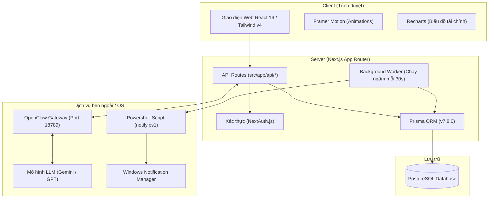

# BÁO CÁO ĐỒ ÁN MÔN HỌC
## ĐỀ TÀI: NGHIÊN CỨU VÀ XÂY DỰNG HỆ THỐNG TRỢ LÝ CÁ NHÂN ĐA NĂNG TÍCH HỢP TRÍ TUỆ NHÂN TẠO – STAR AI

---

## 1. Mục Tiêu Đồ Án

### 1.1. Mục tiêu chính
Nghiên cứu và xây dựng một nền tảng trợ lý cá nhân đa năng, sử dụng **Trí tuệ nhân tạo (Generative AI)** làm cốt lõi để kết nối và quản lý hai lĩnh vực thiết yếu trong đời sống hằng ngày: **Sức khỏe cá nhân** (theo dõi dinh dưỡng, năng lượng nạp vào, lượng nước tiêu thụ) và **Tài chính cá nhân** (theo dõi thu chi, số dư tài khoản, thiết lập ngân sách), kết hợp với công cụ **Lập kế hoạch công việc và quản lý lịch trình**.

### 1.2. Mục tiêu cụ thể
*   **Thiết kế giao diện người dùng (UI/UX) tối ưu:** Phát triển giao diện web hiện đại, trực quan, hỗ trợ hiển thị tốt trên các thiết bị di động (Responsive Web Design). Ứng dụng các chuyển động vi mô (micro-animations) nhằm tối ưu hóa trải nghiệm người dùng và tăng tính tương tác.
*   **Xây dựng mô hình tương tác tự nhiên (Star AI):** Thiết lập một chatbot trợ lý ảo có phong cách giao tiếp thân thiện, gần gũi, giúp giảm bớt sự khô khan trong quá trình quản lý dữ liệu số liệu cá nhân.
*   **Tích hợp cơ chế tự động hóa hành động (Function Calling):** Ứng dụng công nghệ gọi công cụ (Tool Use). Hệ thống có khả năng tự động phân tích câu lệnh phi cấu trúc bằng ngôn ngữ tự nhiên từ người dùng (ví dụ: *"Đã ăn 1 bát phở bò"*, *"Chi 50.000đ gửi xe từ tài khoản ABBank"*) để thực hiện các thao tác thêm, sửa hoặc truy vấn dữ liệu trực tiếp trong cơ sở dữ liệu mà không cần thông qua các thao tác thủ công trên giao diện.
*   **Tính toán các chỉ số sinh học theo công thức khoa học:** Tự động hóa việc tính toán chỉ số năng lượng tiêu chuẩn (BMR/TDEE) theo công thức Mifflin-St Jeor và định lượng nhu cầu tiêu thụ nước hằng ngày dựa trên các chỉ số cơ thể của người dùng.
*   **Hệ thống thông báo đẩy đồng bộ (Native Notifications):** Phát triển một dịch vụ chạy ngầm (Daemon) hỗ trợ giám sát và gửi thông báo nhắc nhở uống nước, nhắc lịch hẹn và công việc đến hạn trực tiếp thông qua hệ thống thông báo của hệ điều hành Windows (Windows Toast Notifications).

---

## 2. Kiến Trúc Hệ Thống

### 2.1. Sơ đồ kiến trúc tổng quát
Hệ thống được thiết kế theo mô hình Client-Server hiện đại, sử dụng framework Next.js cho toàn bộ kiến trúc ứng dụng (Fullstack Framework).



### 2.2. Công nghệ sử dụng
*   **Công nghệ Frontend:**
    *   **React 19 & TypeScript:** Tăng cường tính an toàn của mã nguồn qua kiểm tra kiểu dữ liệu tĩnh và tối ưu hóa chu kỳ render.
    *   **Tailwind CSS v4:** Sử dụng hệ thống utility-first CSS mới nhất để tối ưu dung lượng mã nguồn styling.
    *   **Framer Motion:** Thực hiện xử lý chuyển động cho các thành phần giao diện động, bao gồm widget Star di động (Draggable Star).
    *   **Recharts:** Công cụ trực quan hóa dữ liệu thu chi dưới dạng biểu đồ đường và biểu đồ tròn.
*   **Công nghệ Backend:**
    *   **Next.js (App Router):** Xây dựng hệ thống Routing và các Serverless API phục vụ client.
    *   **Prisma ORM & PostgreSQL:** Quản lý cơ sở dữ liệu quan hệ, thực hiện truy vấn tối ưu và xử lý migration dữ liệu.
    *   **NextAuth.js:** Cung cấp cơ chế xác thực và bảo mật phiên đăng nhập của người dùng.
*   **Tích hợp Trí tuệ nhân tạo (AI Engine):**
    *   **OpenClaw Gateway:** Proxy điều phối API trung gian giữa ứng dụng và mô hình ngôn ngữ lớn (LLM), hỗ trợ cơ chế thực thi công cụ lặp lại nhiều bước (Function Calling loop, tối đa 4 bước lặp) để hoàn thành các logic nghiệp vụ phức tạp.
*   **Hệ thống chạy ngầm và thông báo:**
    *   **Node.js setInterval Worker:** Quét cơ sở dữ liệu định kỳ mỗi 30 giây để tìm kiếm các sự kiện cần nhắc nhở.
    *   **PowerShell (WinRT API):** Thực thi script tương tác trực tiếp với API hệ điều hành để hiển thị thông báo toast.

---

## 3. Chức Năng Chi Tiết

### 3.1. Phân hệ Frontend (FE)
*   **Bảng điều khiển trung tâm (Dashboard):**
    *   Tổng hợp các thông tin nhanh về lượng nước đã uống, lượng calo còn lại được phép nạp trong ngày và danh sách công việc chưa hoàn thành.
    *   Cung cấp tính năng ghi nhanh (Quick logs) nước uống theo định lượng 200ml, 300ml, 500ml.
*   **Phân hệ Quản lý Tài chính (Budget):**
    *   Quản lý danh sách tài khoản nguồn tiền (Ví điện tử, tài khoản ngân hàng) kèm theo quản lý số dư thời gian thực.
    *   Thiết lập hạn mức chi tiêu (Ngân sách tháng) cho từng danh mục để theo dõi chênh lệch giữa dự kiến và thực tế.
    *   Hiển thị lịch sử giao dịch trực quan chia thành 2 danh mục: Thu nhập và Chi tiêu/Chuyển khoản.
*   **Phân hệ Quản lý Dinh dưỡng (Nutrition):**
    *   Ghi chép và tổng hợp năng lượng nạp vào từ thực phẩm.
    *   Tích hợp tính năng phân tích món ăn tự động bằng AI, tự phân rã các bữa ăn phức tạp thành các tùy chọn khẩu phần định lượng khác nhau để người dùng lựa chọn dễ dàng.
*   **Phân hệ Theo dõi Nước uống (Water logs):**
    *   Trực quan hóa lịch sử tiêu thụ nước theo ngày thông qua biểu đồ cột.
    *   Cung cấp cấu hình tùy chỉnh các mốc thời gian nhắc nhở uống nước hằng ngày.
*   **Phân hệ Lịch trình & Việc cần làm (Calendar & Tasks):**
    *   Quản lý sự kiện trên giao diện lịch biểu, hỗ trợ cấu hình sự kiện lặp lại định kỳ (Hằng ngày, hằng tuần, hằng tháng).
    *   Quản lý danh sách công việc cần làm, hỗ trợ đặt hạn chót và trạng thái hoàn thành.
*   **Giao diện Chatbot Star AI:**
    *   Hỗ trợ widget Star kéo thả linh hoạt trên màn hình. Cho phép mở khung chat nhanh hoặc hiển thị các đề xuất tự động từ AI ngay trên màn hình hiện tại.

### 3.2. Phân hệ Backend (BE)
*   **Hệ thống RESTful API:** Cung cấp các endpoint xử lý nghiệp vụ cho các phân hệ giao dịch, dinh dưỡng, nước uống, lịch biểu và công việc.
*   **Cổng xử lý hội thoại và Vòng lặp Công cụ:**
    *   Endpoint `/api/chat` tiếp nhận tin nhắn từ người dùng, nạp lịch sử hội thoại (giới hạn 15 tin nhắn gần nhất nhằm tối ưu chi phí token) và cấu hình `SYSTEM_PROMPT`.
    *   Thiết lập cơ chế kiểm soát lỗi hội thoại và chạy vòng lặp thực thi công cụ (tối đa 4 vòng). 
    *   *Ví dụ:* Người dùng yêu cầu *"Chi 50.000đ gửi xe từ tài khoản ABBank"* -> AI tự động gọi `get_budget_status` để kiểm tra danh mục tồn tại -> AI ánh xạ từ khóa để xác định loại giao dịch `EXPENSE` và danh mục `Tiền gửi xe` -> AI thực thi `log_transaction` -> AI tổng hợp kết quả phản hồi người dùng.

### 3.3. Mô Hình Dữ Liệu (Data Models - Prisma Schema)
*   `User`: Quản lý tài khoản người dùng, email, mật khẩu và liên kết dữ liệu.
*   `Profile`: Lưu trữ các thông số sinh học (giới tính, chiều cao, cân nặng, tuổi, mức độ vận động) và lượng calo tiêu chuẩn.
*   `MealEntry`: Lưu trữ thông tin nhật ký ăn uống bao gồm khối lượng thực phẩm (gram) và lượng calo tương ứng.
*   `WaterLog` & `WaterReminderSlot`: Lưu trữ lịch sử uống nước và cấu hình các khung giờ nhắc nhở.
*   `BudgetAccount`: Quản lý các tài khoản tài chính (tên tài khoản, số dư hiện tại, màu sắc nhận diện).
*   `BudgetCategory`: Quản lý danh mục phân loại giao dịch (tên danh mục, loại giao dịch: `INCOME`/`EXPENSE`).
*   `BudgetTransaction`: Nhật ký giao dịch chi tiết, liên kết trực tiếp với tài khoản nguồn, tài khoản đích và danh mục phân loại tương ứng.
*   `CalendarEvent` & `TaskItem`: Lưu trữ thông tin lịch trình (hỗ trợ trường lặp lại `recurrence`: `DAILY`/`WEEKLY`/`MONTHLY`) và công việc.
*   `ChatSession` & `ChatMessage`: Lưu trữ thông tin về các phiên hội thoại và nội dung tin nhắn.

---

## 4. Kịch Bản Hoạt Động Của Hệ Thống (Ví dụ Ghi nhận giao dịch)

Sơ đồ mô tả quy trình xử lý tự động khi người dùng yêu cầu ghi nhận giao dịch thông qua ngôn ngữ tự nhiên:

```
[Người dùng]: "Ghi lại cho tớ khoản chi 50k vào mục tiền gửi xe ở tk ABBank nhé"
    |
    v (API /api/chat tiếp nhận yêu cầu)
    |
    +---> BƯỚC 1: AI xác định yêu cầu tài chính -> Gọi tool "get_budget_status"
    |            |
    |            +---> Trả về danh sách tài khoản hiện tại: ["Ví Momo", "ABBank", "Tiền mặt"]
    |                  và các danh mục hiện có: ["Ăn uống", "Đi lại", "Tiền gửi xe"]
    |
    +---> BƯỚC 2: AI phân tích ngữ nghĩa ngôn ngữ tự nhiên:
    |            * Số tiền giao dịch: 50.000đ
    |            * Hành động "khoản chi" -> Gán loại giao dịch (type) là "EXPENSE"
    |            * Trích xuất "ở tk ABBank" -> Khớp với tài khoản "ABBank" trong cơ sở dữ liệu
    |            * Trích xuất "tiền gửi xe" -> Khớp với danh mục "Tiền gửi xe" trong cơ sở dữ liệu
    |            * Thực thi gọi công cụ "log_transaction(amount: 50000, type: 'EXPENSE', fromAccountName: 'ABBank', categoryName: 'Tiền gửi xe')"
    |
    +---> BƯỚC 3: Backend xử lý cơ sở dữ liệu (Database Transaction):
    |            * Khởi tạo bản ghi giao dịch BudgetTransaction mới.
    |            * Trừ số dư tương ứng của tài khoản ABBank đi 50.000đ.
    |
    v (Trả về trạng thái xử lý thành công)
[Star AI]: "Đã ghi nhận giao dịch chi tiêu: -50.000đ cho danh mục Tiền gửi xe từ tài khoản ABBank thành công rồi nha! 🥰💖"
```

---

## 5. Đánh Giá Ưu Điểm & Nhược Điểm

### 5.1. Ưu điểm
*   **Tính toàn diện cao:** Tích hợp thành công ba tính năng cốt lõi (Theo dõi sức khỏe, Quản lý tài chính cá nhân, Lập lịch biểu) trên cùng một hệ thống giúp tối ưu hóa tài nguyên phần cứng và đơn giản hóa thao tác cho người dùng.
*   **Trải nghiệm tương tác tự nhiên:** Chatbot AI sử dụng phong cách giao tiếp gần gũi, tạo cảm giác thân thiện và tăng động lực duy trì thói quen theo dõi chỉ số cá nhân hằng ngày.
*   **Tối giản hóa thao tác nhờ AI:** Giảm thiểu tối đa việc nhập liệu truyền thống thông qua cơ chế phân tích ngôn ngữ tự nhiên và tự thực thi gọi công cụ (Function Calling).
*   **Hoạt động nền đáng tin cậy:** Hệ thống daemon chạy ngầm tương tác trực tiếp với API của hệ điều hành, đảm bảo thông báo nhắc nhở luôn được gửi đến người dùng đúng thời điểm ngay cả khi đóng trình duyệt.

### 5.2. Nhược điểm
*   **Phụ thuộc vào hạ tầng mạng:** Các tính năng phân tích thông minh yêu cầu kết nối liên tục tới OpenClaw Gateway và mô hình ngôn ngữ lớn (LLM), hoạt động sẽ bị giới hạn khi không có Internet.
*   **Độ trễ phản hồi (Latency):** Do mô hình LLM cần thời gian xử lý phân tích và thực hiện vòng lặp gọi API tuần tự, thời gian phản hồi trung bình dao động từ 1.5 đến 3 giây.
*   **Thách thức xử lý ngữ nghĩa tiếng Việt:** Các cấu trúc câu đa nghĩa, từ viết tắt hoặc lối nói ẩn dụ trong tiếng Việt đôi khi có thể gây nhầm lẫn cho mô hình trong quá trình phân loại nghiệp vụ (Ví dụ: từ "gửi" trong "gửi tiết kiệm" hoặc "gửi xe" dễ bị nhầm lẫn giữa chi tiêu và chuyển khoản).

---

## 6. Định Hướng Phát Triển

### 6.1. Xây dựng ứng dụng di động (Mobile App)
Chuyển đổi nền tảng sang ứng dụng di động native bằng **React Native** hoặc **Flutter** nhằm tối ưu hóa khả năng tiếp cận:
*   Hỗ trợ các widget hiển thị chỉ số calo và nước uống trực tiếp trên màn hình chính và màn hình khóa điện thoại.
*   Tích hợp tính năng nhận diện giọng nói (Speech-to-Text) cho phép người dùng ghi nhận nhanh các chỉ số khi đang di chuyển.
*   Chuyển đổi hệ thống thông báo sang cơ chế đẩy từ máy chủ (FCM/APNs).

### 6.2. Phát triển Chrome Extension riêng cho Star AI
Phát triển một tiện ích mở rộng trên trình duyệt Google Chrome để tối ưu hóa hiệu quả sử dụng trên máy tính:
*   **Tiện ích thường trực:** Đặt biểu tượng Star AI nhỏ thường trực ở góc màn hình trình duyệt.
*   **Tương tác nhanh không cần chuyển tab:** Người dùng có thể gọi nhanh Star AI để ghi chép chi tiêu, cập nhật công việc hoặc xem lịch biểu ngay khi đang làm việc trên các trang web khác mà không cần truy cập trực tiếp vào ứng dụng chính.
*   **Popup cảnh báo:** Tự động hiển thị popup nhắc nhở uống nước hoặc thông báo công việc trên tab làm việc hiện tại của trình duyệt.

### 6.3. Tự động hóa tích hợp tài chính
*   Nghiên cứu tích hợp các giải pháp đọc lịch sử biến động số dư ngân hàng qua API mở hoặc quét SMS thông báo biến động số dư trên điện thoại nhằm tự động hóa hoàn toàn luồng ghi chép tài chính cá nhân.

---

## 7. Kết Luận

Đề tài **Nghiên cứu và xây dựng hệ thống trợ lý cá nhân đa năng Star AI** đã hoàn thành các mục tiêu đặt ra. Ứng dụng giải quyết tốt bài toán quản lý cá nhân bằng cách kết hợp khoa học dữ liệu sức khỏe, quản lý tài chính và công nghệ trí tuệ nhân tạo hiện đại. Việc ứng dụng cơ chế **Function Calling** mang lại một phương thức tương tác người-máy vô cùng tự nhiên và hiệu quả. Mặc dù vẫn còn một vài giới hạn về mặt độ trễ xử lý của mô hình AI, ứng dụng hoàn toàn có đủ khả năng ứng dụng thực tế và sở hữu tiềm năng mở rộng cao trên nền tảng di động cũng như các tiện ích mở rộng trình duyệt trong tương lai.
